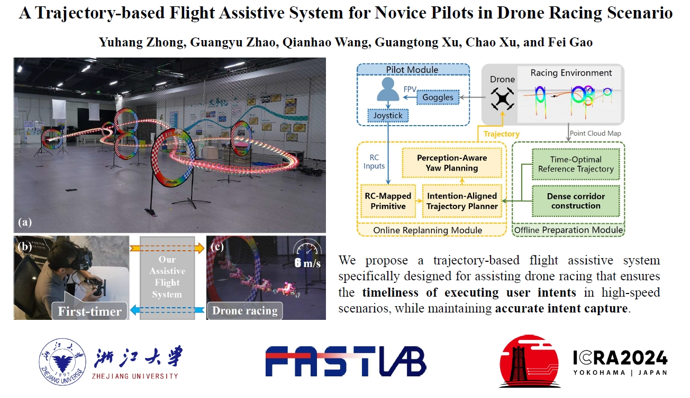

# Assistive-Racing

We propose a trajectory-based flight assistive system specifically designed for assisting drone racing that ensures the timeliness of executing user intents in high-speed scenarios, while maintaining accurate intent capture.

**[ICRA 2024]** Open source code for paper **A Trajectory-based Flight Assistive System for Novice Pilots in Drone Racing Scenario**

Video Links: [Bilibili](https://www.bilibili.com/video/BV13w411Y7un/?spm_id_from=333.999.0.0&vd_source=6ecd26e8a45e64856bbd969850e00d6f).

  <p align="center">
    
  </p>

## 1. Quick Start

The project has been tested on Ubuntu 20.04(ROS Noetic). run the following commands to setup:

```
  git clone https://github.com/ZJU-FAST-Lab/Assistive-Racing.git
  catkin_make
```

jsk-rviz-plugins is used to simulate the FOV in rviz, and joy package is used to receive user input. you can install them by running the following commands:
```
  sudo apt-get install ros-noetic-jsk-rviz-plugins
  sudo apt-get install ros-noetic-joy
```
**before running code, ensure joystick is connect to your pc successfully!**

Firstly, generate the optimal reference trajectory and flight corridors offline:

```
  roslaunch map_generator offline_generate.launch
```

check if generated files exist in plan_manage/offlines, then run the following command to start flying:
```
  roslaunch plan_manage test.launch
```
trigger the 5 channel on your joystick to start fly!

**Attention**: We provide the param files for Blacksheep joystick and XBOX joystick, you can check the joystick type in test.launch, for other joystick, you need to modify the realted param files.

## 2. Load your own map
our code support loading your own map, you can place your map(.pcd) in plan_manage/pcd/, and your gate information(gate.yaml) in plan_manage/config/. Then running the code agian to fly in your own map!


## 3. Acknowledgement
We use [**MINCO**](https://github.com/ZJU-FAST-Lab/GCOPTER) as our trajectory representation. and We use [**DecompROS**](https://github.com/sikang/DecompROS) for safe flight corridor generation and visualization.


